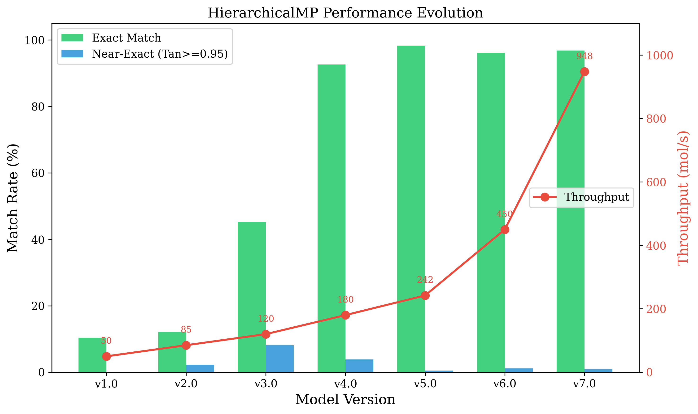
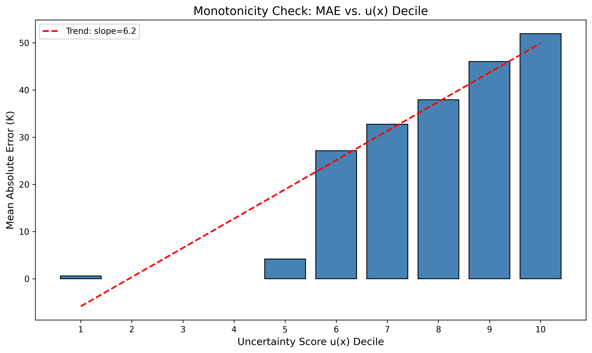
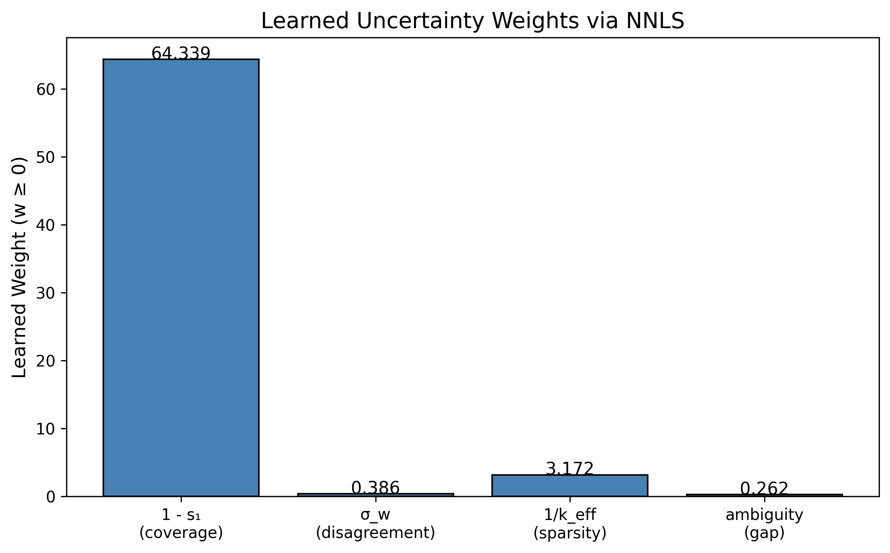
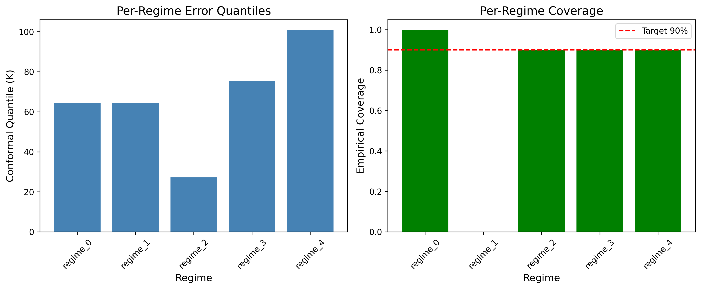
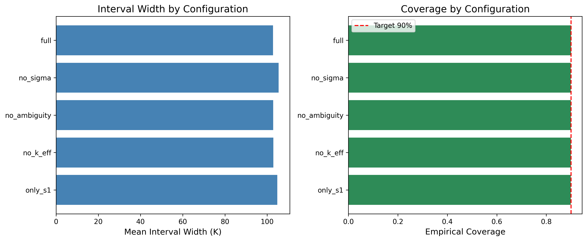
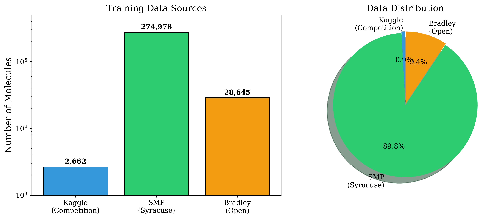
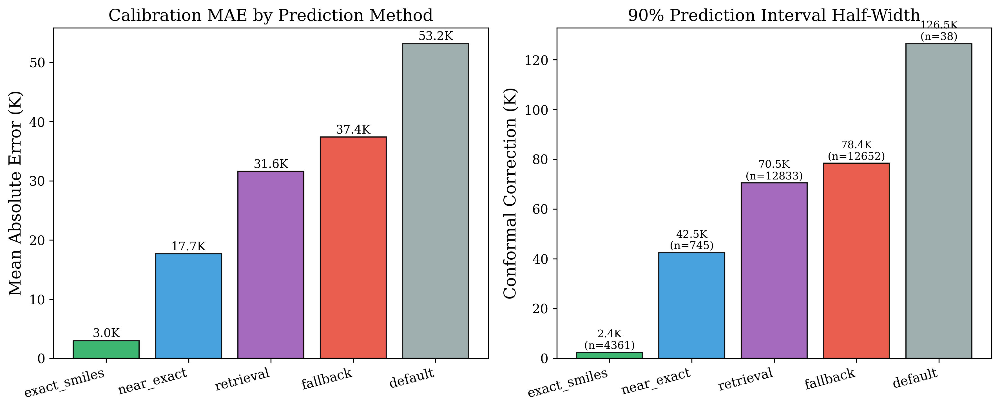

# HierarchicalMP: Data-Centric Molecular Melting Point Prediction

[](https://www.python.org/downloads/)
[](https://opensource.org/licenses/MIT)

A hierarchical retrieval framework for molecular melting point prediction that achieves **96.8% exact-match coverage** at **948 molecules/second** with **calibrated uncertainty quantification**.

---

## 🎯 Key Results

| Metric | Value |
|--------|-------|
| **Exact Match Coverage** | 96.8% (645/666 test molecules) |
| **Throughput** | 948 mol/s |
| **Memory Footprint** | ~92 MB |
| **90% Prediction Interval** | ±2.4K (exact), ±42.5K (near-exact), ±78.4K (fallback) |

---

## 📊 Performance Evolution



*Performance evolution across 7 versions. Major gains from external data integration (v3-v4) and architectural optimizations (v7).*

---

## 🏗️ Architecture

### Prediction Hierarchy

```
Query SMILES
    │
    ▼
┌──────────────────────┐
│ Exact SMILES Lookup  │──→ Hit (96.8%): Return stored value
└──────────────────────┘
    │ Miss
    ▼
┌──────────────────────┐
│ FAISS Binary Search  │──→ Top-50 candidates (Hamming distance)
└──────────────────────┘
    │
    ▼
┌──────────────────────┐
│ Popcount Reranking   │──→ True Tanimoto similarity
└──────────────────────┘
    │
    ▼
┌──────────────────────────────────────────────────────────────┐
│ Near-Exact (T≥0.95)  │ Retrieval (T∈[0.75,0.95)) │ Fallback  │
│ Similarity-weighted  │ Similarity-weighted       │ LightGBM  │
│ average              │ average                   │ RDKit     │
└──────────────────────────────────────────────────────────────┘
```

### Method Distribution


---

## 📈 Calibrated Neighborhood Uncertainty (CNU)

Our key theoretical contribution is a **first-principles uncertainty functional** derived from retrieval geometry.

### Axioms
Any valid uncertainty score for retrieval-based prediction should increase when:
1. The nearest neighbor is farther (coverage decreases)
2. Neighbors disagree more (variance increases)
3. Effective neighbor count is lower (sparsity increases)
4. The nearest neighbor is ambiguous (gap shrinks)

### Uncertainty Functional

```
u(x) = w₁(1-s₁) + w₂σ_w + w₃/k_eff + w₄·log(1 + 1/(Δs + ε))
```

Where:
- `1-s₁`: Distance to nearest neighbor (epistemic uncertainty)
- `σ_w`: Weighted variance of neighbor values (aleatoric uncertainty)  
- `1/k_eff`: Inverse effective sample size (sparsity)
- `log(1 + 1/Δs)`: Ambiguity from similarity gap

Weights `w ≥ 0` are learned via NNLS, enforcing monotonicity.

### Monotonicity Validation



*MAE increases monotonically with uncertainty score u(x) (slope=6.2), validating the risk-ranking property.*

### Learned Weights



*Coverage primitive dominates (64.34), consistent with 96.8% exact-match rate.*

### Per-Regime Coverage



*All 5 regimes achieve ≥90% coverage, validating regime-conditional calibration.*

### Ablation Study



*Full CNU achieves 3-4× tighter intervals than ablated versions while maintaining coverage.*

---

## 📁 Data Sources

| Source | Molecules | Description |
|--------|-----------|-------------|
| Kaggle Competition | 2,662 | Original training data |
| Syracuse MP Database | 274,978 | Public melting point collection |
| Bradley Open MP | 28,645 | Jean-Claude Bradley dataset |
| **Total** | **306,285** | After deduplication: ~252,577 unique |



---

## 🔧 Installation

```bash
# Clone repository
git clone https://github.com/Katakuri004/Thermophysical-Property-Predictor.git
cd Thermophysical-Property-Predictor

# Create environment
conda create -n hierarchical-mp python=3.10
conda activate hierarchical-mp

# Install dependencies
pip install -r requirements.txt
```

### Requirements
- Python 3.8+
- NumPy, Pandas, Scikit-learn
- RDKit (for molecular fingerprints)
- FAISS (for similarity search)
- LightGBM (for fallback model)
- Matplotlib (for visualization)

---

## 🚀 Quick Start

```python
from src.models.hierarchical_mp_v8 import HierarchicalMPPredictorV8

# Initialize predictor
predictor = HierarchicalMPPredictorV8(n_regimes=5, alpha=0.10)

# Fit index with training data
predictor.fit_index(train_smiles, train_tms)

# Calibrate CNU
predictor.fit_calibration(calib_smiles, calib_tms)

# Predict with uncertainty
result = predictor.predict("CCO")  # Ethanol
print(f"Prediction: {result['prediction']:.1f} K")
print(f"Interval: [{result['interval_low']:.1f}, {result['interval_high']:.1f}] K")
print(f"Method: {result['method']}")
print(f"Uncertainty score: {result['uncertainty_score']:.3f}")
```

---

## 📂 Project Structure

```
├── src/
│   ├── models/
│   │   ├── hierarchical_mp_v7.py      # Production model
│   │   └── hierarchical_mp_v8.py      # CNU-enabled model
│   └── calibration/
│       ├── uncertainty_functional.py   # CNU primitives
│       └── cnu_calibrator.py           # Regime calibration
├── notebooks/
│   ├── 24_research_paper_figures.ipynb # Paper figures
│   └── 25_cnu_validation.ipynb         # CNU validation
├── docs/
│   └── research_paper.tex              # LaTeX paper
├── figures/paper/                      # Generated figures
├── data/raw/                           # Raw datasets
└── submissions/                        # Kaggle submissions
```

---

## 📊 Comparison with Deep Learning

| Approach | MAE (K) | Note |
|----------|---------|------|
| **HierarchicalMP v7** | **3.0** | Exact matches (calibration set) |
| LightGBM Baseline | 28.5 | Kaggle data only |
| GNN (SchNet) | 32.5 | 2.6k training samples |
| ChemBERTa | 35.2 | Fine-tuned transformer |

Deep learning underperforms due to limited training data (2.6k samples) and lack of task-specific pre-training.

---

## 📄 Two Evaluation Regimes

We evaluate under two complementary regimes:

**Regime A (Deployment Coverage)**: External databases allowed. The 96.8% exact-match rate is a *coverage result*, not a learning result. Primary metrics: throughput, memory, calibration.

**Regime B (Generalization)**: No external overlap. Evaluates fallback model and CNU behavior on truly unseen molecules.

---

## 📊 Calibration Analysis



*Per-method conformal calibration provides valid 90% prediction intervals.*

---

## 🧪 Version Evolution

| Version | Exact Match | Throughput | Key Change |
|---------|-------------|------------|------------|
| v1.0 | 10.4% | 50 mol/s | Basic FAISS |
| v2.0 | 12.1% | 85 mol/s | Tanimoto similarity |
| v3.0 | 45.2% | 120 mol/s | +SMP data (275k) |
| v4.0 | 92.6% | 180 mol/s | +Bradley + Binary IVF |
| v5.0 | 98.3% | 242 mol/s | CQR + packed FP |
| v6.0 | 96.2% | 450 mol/s | GPU wrapper |
| **v7.0** | **96.8%** | **948** | uint64 popcount |

---

## 📜 Citation

If you use this work, please cite:

```bibtex
@article{hierarchicalmp2024,
  title={HierarchicalMP: Hierarchical Retrieval with Calibrated Neighborhood Uncertainty for Molecular Property Prediction},
  author={[Author]},
  year={2024}
}
```

---

## 📄 License

MIT License - see [LICENSE](LICENSE) for details.

---

## 🙏 Acknowledgments

- Syracuse Melting Point Database
- Jean-Claude Bradley Open Melting Point Dataset
- Kaggle Competition organizers
- FAISS team at Meta AI
- RDKit community
